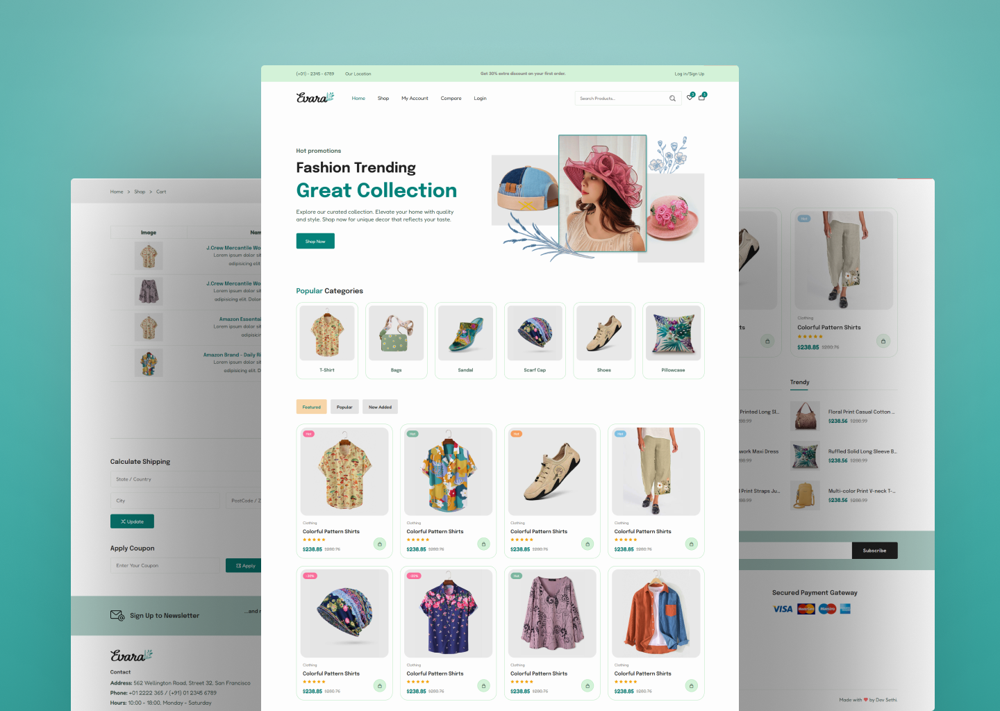

# Evara E-Commerce Website

Welcome to the **Evara E-Commerce Website** repository!  
This is a fully responsive web application built using **HTML**, **CSS**, and **JavaScript**, designed to deliver a seamless and modern online shopping experience. 🧑‍💻✨

It features a beautiful landing page, product browsing, shopping cart, and a checkout process — all styled with a sleek UI and responsive layout.


## Preview



## Features

- **Responsive Design:** Ensures optimal viewing on various devices for a seamless shopping experience.
- **Slider:** Engage users with a visually appealing slider showcasing featured products or promotions.
- **Multiple Pages:** Explore different sections such as the shop, cart, and checkout for comprehensive e-commerce functionality.
- **Modern UI Design:** Sleek layout and visually appealing design for an enjoyable user interface.

## Getting Started

To explore this e-commerce website locally, follow these steps:

1. Clone the repository to your local machine:

   ```bash
   git clone https://github.com/Sanjanayadav07/Ecommerce-Website.git
   ```

2. Open the `index.html` file in your preferred web browser.

## Pages

### Home

Welcome users to the Evara E-Commerce platform, featuring the latest products and promotions.

### Shop

Browse through the available products and filter items based on categories.

### Cart

Review selected items, adjust quantities, and proceed to checkout.

### Checkout

Complete the purchase process by providing shipping details and payment information.

## Customization

Feel free to customize this website to fit your specific e-commerce needs. Update content, images, and styles in the HTML, CSS, and JavaScript files.

## Contributing

If you'd like to contribute to this project, please follow these steps:

1. Fork the repository.
2. Create a new branch for your feature or improvement.
3. Make your changes and commit them with descriptive messages.
4. Push your changes to your forked repository.
5. Open a pull request to merge your changes into the main branch.

Explore the Evara E-Commerce Website, provide feedback, and consider contributing to its development. Thank you for checking out the repository!
